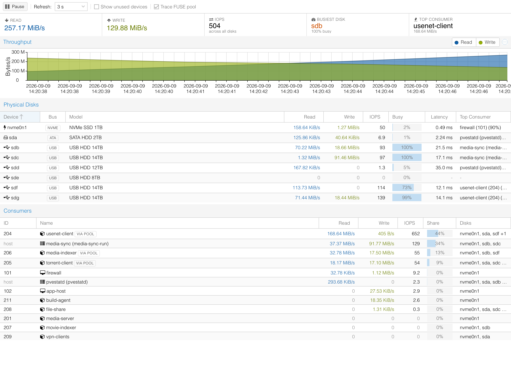
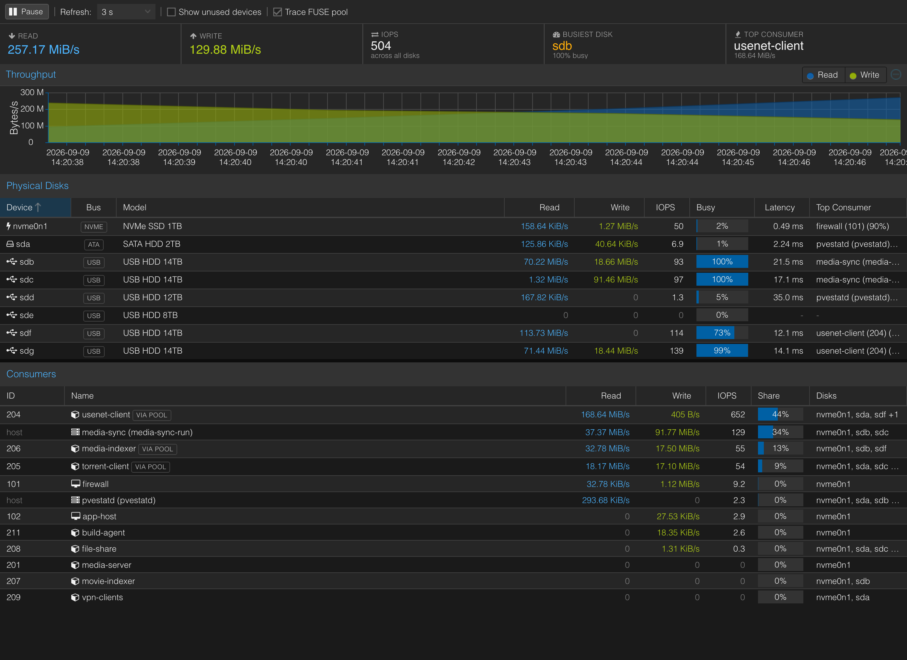
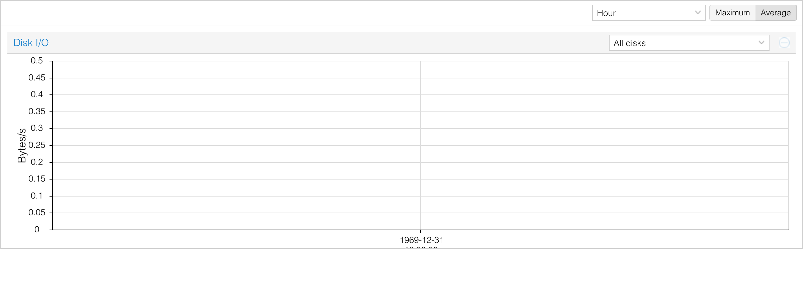
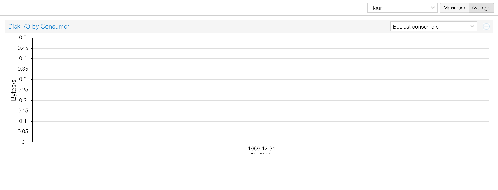
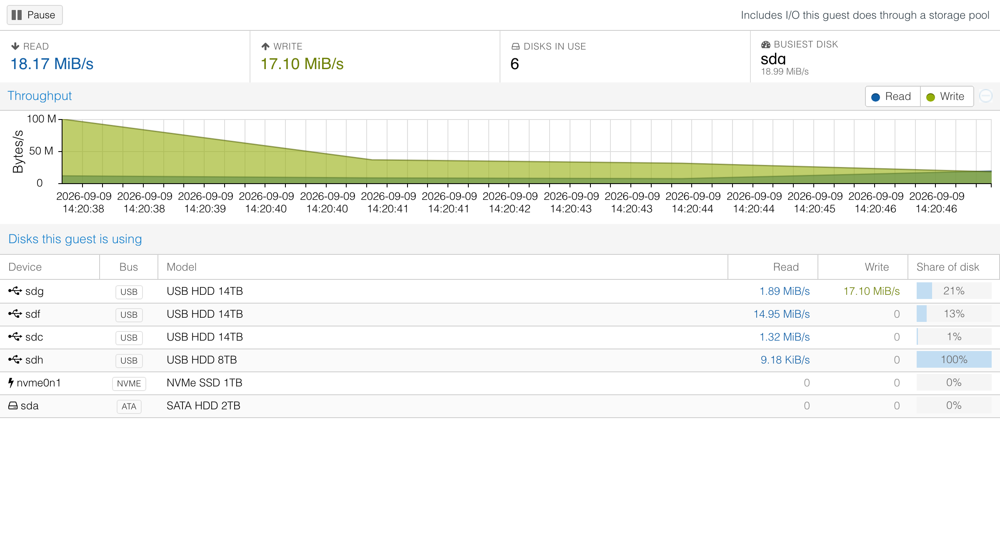
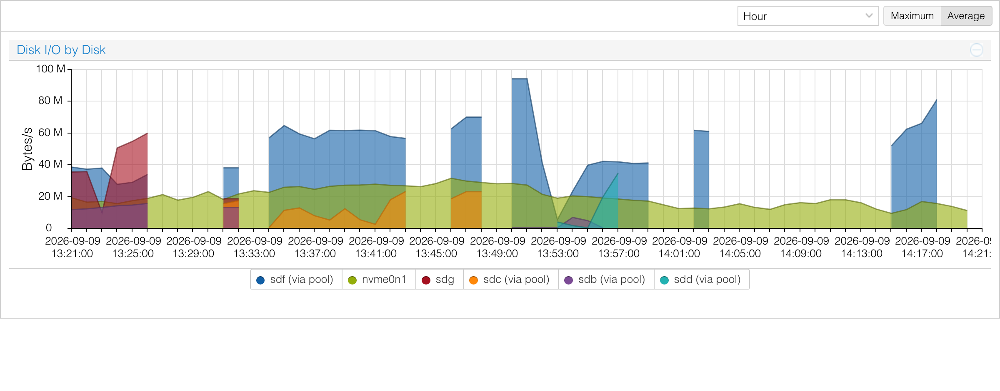

# Disk I/O panel for Proxmox VE

Proxmox tells you a disk is busy. It does not tell you *what is making it busy*.

This adds that: a live view of what a node's physical disks are doing, which
containers and VMs are responsible, and recorded history for both — built into
the web UI rather than bolted on beside it.



<sub>Screenshots are real data from a live node, with guest names and disk models
anonymised.</sub>

It also sees through **mergerfs and other FUSE pools**, which is the case stock
tooling gets most wrong. A container writing to a pool never touches a block
device itself, so the kernel — and every tool built on it — credits the pool's
daemon. See [Seeing through a FUSE pool](#seeing-through-a-fuse-pool).

Tested on Proxmox VE 9.2. It touches no `pvemanagerlib.js`, so an upgrade
cannot leave a half-applied patch behind.

---

## Contents

- [What you get](#what-you-get)
- [Install](#install)
- [Seeing through a FUSE pool](#seeing-through-a-fuse-pool)
- [How the numbers are produced](#how-the-numbers-are-produced)
- [History and storage](#history-and-storage)
- [What it costs](#what-it-costs)
- [Limitations](#limitations)
- [Uninstall](#uninstall)
- [Developing](#developing)

---

## What you get

### Node → Disks → I/O Activity

The live view. Throughput, IOPS, utilisation, average latency and queue depth
per physical disk, refreshing every 1–30s, with the consumers driving it
underneath.


Reading it:

- **Bus** is shown because it usually explains the latency. In the shot above
  the USB disks sit at 100% busy and 17–21ms while the NVMe is at 2% and
  0.49ms.
- **Busy** is real utilisation, derived from `io_ticks` — the proportion of the
  interval the queue was non-empty, the same figure `iostat` calls `%util`.
- **Top Consumer** names who is doing it, and what share of that disk they are.
- **Share** in the consumer list is a proportion of all attributed block I/O.
- **VIA POOL** marks a consumer whose bytes were measured against a FUSE
  daemon and handed to it. More on that below.
- Selecting a disk rescopes the consumer list to that disk alone, so *"what is
  hammering sdb?"* is one click.
- Host processes appear too — `media-sync` and `pvestatd` in the shot are
  systemd units, not guests. A script moving media is as much a consumer of a
  disk as any container.

It follows the theme:



### Drive health, and doing something about it

The Health column carries a **SMART** button. It opens a window with the
drive's identity, temperature, power-on hours, which filesystems it carries,
and — the part the overall SMART flag hides — which attributes are failing
**now** as opposed to at some point in the past.

That distinction matters more than it sounds. `smartctl` reports each
attribute's `when_failed` as `now`, `past` or nothing at all, where `past` is
derived from the sticky `WORST` column and **never clears**. A drive that ran
hot once is marked forever, so treating `past` as a current fault means a
healthy drive shows as failing for the rest of its life. Only `now` means the
attribute is below its threshold today.

From that window, a row of actions:

| Action | Writes? | Notes |
|---|---|---|
| Short self-test | no | ~2 minutes, the drive tests itself |
| Extended self-test | no | Full surface read; hours, but the only way to confirm pending sectors are really unreadable |
| Conveyance self-test | no | Checks for transit damage |
| Abort running self-test | no | |
| Read-only surface scan | no | Reads every block and reports what will not come back. Safe on a mounted disk; niced and `ionice -c3` |
| Full SMART report | no | Second window: every attribute, plus the self-test log |
| Rewrite sectors | **yes** | Forces a pending sector to be retired to the spare pool. Data in an already-unreadable sector is lost — the rewrite is what tells the drive to give up on it |
| Destructive write/read test | **yes** | Erases the disk |

**The two write actions are gated twice.** The UI disables them when the disk
carries a mounted filesystem, and the API refuses them independently — so a
stale browser tab cannot start one. They also require you to type the drive's
serial number to confirm, which forces you to look at the drive rather than the
row you happened to click. The mount check walks the whole stacking graph
(partitions → LVM → dm-crypt → md), because a disk holding an LVM thin pool has
no filesystem mounted from `/dev/sdX` itself and a naive check calls it idle.

Long-running scans detach and report progress back into the window, so closing
it does not kill the job. Every action is written to the syslog with the user
who asked for it, and the write actions need `Sys.Modify` rather than the
`Sys.Audit` the rest of the panel uses.

### Node → Summary → Disk I/O

Recorded per-disk history, beside the CPU, memory and network graphs, driven by
the same Hour/Day/Week/Month/Year selector as the rest of the page.



It overlays every disk by default; the picker in the header narrows to one,
which then splits into read and write.

### Node → Summary → Disk I/O by Consumer

The same window, answered the other way round: who was responsible.



Consumers are ranked by what they actually did **within the window on screen**,
so switching to Day or Week re-ranks — whoever mattered overnight is not
necessarily whoever matters this hour. Everything below the top few is summed
into `Other`. Host units are ranked alongside guests.

### Any guest → Disk I/O

Every LXC and VM gets its own page, next to the hardware it describes.



**Share of disk** is the useful column: how much of *that disk's* traffic is
this guest. In the shot `sdh` is 100% — this container is the only thing
touching it — while `sdg` is 21%, because it is competing with other
consumers for that spindle.

### Any guest → Summary → Disk I/O by Disk

PVE already graphs a guest's total read/write. This adds which spindle it
landed on.



Note the `(via pool)` markers: for this guest the media disks are apportioned
through mergerfs while `nvme0n1` is its own direct I/O. That distinction is
per-disk, not per-guest — the same container has both at once.

---

## Install

Two options. Both are idempotent and both reverse cleanly.

### Debian package (recommended)

```bash
git clone https://github.com/grioghar/proxmox-disk-io
cd proxmox-disk-io
./packaging/build-deb.sh          # needs dpkg-deb; run it on the node
apt install ./dist/pve-disk-io_1.0.0_all.deb
```

**Prefer the package** for one specific reason: it registers a dpkg trigger on
the PVE directories it edits, so when `pve-manager` is upgraded and overwrites
them, the integration is re-applied automatically. The shell installer has no
such hook.

### Shell script

```bash
git clone https://github.com/grioghar/proxmox-disk-io
cd proxmox-disk-io
sudo ./scripts/install.sh
```

Re-run it after every `pve-manager` upgrade, or the panel quietly disappears.

### Either way

Hard-reload the browser afterwards (**Ctrl-Shift-R**) — the page itself is
cached and carries the reference to the new script.

Per-disk history starts empty and fills in over the following hour; Day, Week,
Month and Year accumulate from install.

### What gets touched

| | |
| --- | --- |
| new | `/usr/share/perl5/PVE/DiskIO.pm` — shared stats, RRD layout, attribution |
| new | `/usr/share/perl5/PVE/API2/Disks/IO.pm` — the API endpoints |
| new | `/usr/share/pve-manager/js/pve-disk-io.js` — the whole UI |
| new | `/usr/sbin/pve-disk-io-collector` — records history once a minute |
| new | `/usr/share/pve-disk-io/integrate.sh` — applies and reverses the two edits |
| new | `/lib/systemd/system/pve-disk-io-collector.{service,timer}` |
| edit | `/usr/share/perl5/PVE/API2/Disks.pm` — registers the API subclass |
| edit | `/usr/share/pve-manager/index.html.tpl` — loads the panel |

Pristine copies of the two edited files are kept in
`/var/backups/pve-disk-io/`.

**`pvemanagerlib.js` is deliberately never patched.** The panel adds itself to
the node menu, the guest menus and both Summary pages with runtime
`Ext.define({override: ...})` calls. A `pve-manager` upgrade replaces that file
wholesale; because nothing of ours is in it, an upgrade can remove the
integration but can never leave it half-applied.

---

## Seeing through a FUSE pool

This is the part that makes the panel worth having on a media host, and the
part most likely to surprise you.

### The problem

A container writing to a mergerfs pool does not touch a block device. It makes
a syscall; the mergerfs daemon, a process on the *host*, does the actual I/O.
The block layer therefore attributes every one of those bytes to the daemon —
and so does every cgroup built on it, which means so does Proxmox, `iotop`,
`pidstat`, and anything else reading the same counters.

Left alone, the panel would truthfully report

> `/mnt/pool (mergerfs)` is writing 113 MB/s to `sdf`

while hiding the only thing worth knowing, which is who asked it to.

### What this does instead

The daemon is treated as what it is — a passthrough. It is **not listed as a
consumer at all**. Its per-disk bytes are handed to the callers holding files
open on the pool, and those callers appear instead, both in the consumer list
and as a disk's **Top Consumer**:

| Disk | Stock view | Here |
| --- | --- | --- |
| sdf | `/mnt/pool (mergerfs)` | **usenet-client (204)** |
| sdg | `/mnt/pool (mergerfs)` | **usenet-client (204)** |
| sdb | `/mnt/pool (mergerfs)` | **media-sync** — a host unit |
| sdc | `/mnt/pool (mergerfs)` | **media-sync** — a host unit |

Host callers count too: a script pooling media is as much a consumer as a
container is, and shows up by name beside them.

### How it works

- **Callers are found by matching open descriptors on the pool's `st_dev`**,
  not on a path prefix. A container sees the pool at its own mountpoint —
  `/storage` in one, `/mnt/pool` in another — so matching on the path finds
  nothing. Matching on the filesystem finds them all.
- **The disk behind each file comes from mergerfs's own
  `user.mergerfs.basepath` xattr**, resolved through the mount table. That is
  what makes per-disk attribution possible at all: the pool knows which branch
  a file lives on, and will tell you if you ask.
- **The daemon is identified by holding `/dev/fuse` open** with the mountpoint
  in its command line. Its own file handles point at the branches rather than
  at the pool, so it never looks like a caller of itself.
- **Callers are aggregated by owner, never by pid.** Pids churn constantly
  here — a transcode or an unpack is a fresh process every time; on the
  development node the caller set changed between four of any six consecutive
  polls. Matching on pids dropped a caller the moment its process was replaced,
  and sent that disk's whole load into an unattributed bucket.
- **Writeback is handled.** It lands long after the write, usually once the
  file is closed, so a disk whose pool traffic has no caller *currently*
  holding a descriptor falls back to splitting across every active caller
  rather than crediting nobody.

### What is measured and what is inferred

This matters, so it is stated plainly rather than buried.

- The **quantity** apportioned is block level throughout. A disk's attributed
  bytes still add up to what the disk really did.
- Only the **split between callers** comes from syscall counters
  (`rchar`/`wchar`, weighted by how many of each caller's open files sit on
  that disk).

So when several containers hit the same disk through the pool at once, treat
the proportions as a strong approximation rather than a measurement. Once FUSE
is in the middle the kernel simply does not record which caller each block
write came from. Rows credited this way carry a **VIA POOL** tag in the live
panel and a `(via pool)` marker in history, so the distinction is always
visible.

If nothing at all is using the pool and it is still moving bytes — writeback
with every caller already exited — that appears as a single
`<mountpoint> (no active caller)` row. Dropping those bytes instead would
leave the disk's totals not adding up.

### Cost, and turning it off

Finding which processes hold files open means walking `/proc/*/fd`, which costs
around 500ms. That is cached for 30s — a transcode or an unpack lasts minutes —
so ordinary polls stay at about 60ms.

It is **on by default**, because without it the daemon absorbs the credit for
everything and the panel answers the wrong question. Untick **Trace FUSE pool**
in the toolbar to skip the scan, at the cost of the daemon reappearing as the
consumer.

Nothing here is mergerfs-specific beyond the branch xattr: any FUSE filesystem
gets caller attribution, and only the per-disk breakdown needs mergerfs.

---

## How the numbers are produced

`GET /nodes/{node}/disks/io` returns raw monotonic counters and a
high-resolution timestamp. Every rate is derived in the browser from the delta
between two samples, so the endpoint stays stateless and rates reflect real
elapsed time rather than an assumed interval.

| Source | Used for |
| --- | --- |
| `/proc/diskstats` | per-disk throughput, IOPS, utilisation, latency, queue |
| `/sys/block/*`, `/run/udev/data/b*` | model, serial, size, bus, scheduler |
| cgroup v2 `io.stat` | per-container and per-host-unit I/O, per device |
| QMP `query-blockstats` | per-VM I/O, per drive |
| `/proc/*/fd`, `user.mergerfs.basepath` | FUSE pool callers and their disks |

Three details worth knowing:

- **Containers.** The cgroup io controller charges every layer of the stack, so
  a container on LVM appears against both the dm device and the physical disk
  beneath it. Summing all lines would double count, so only physical disks are
  counted. This was verified to be exact: for a sample container the physical
  disk's byte count equalled the sum of its dm children.
- **VMs.** `qemu.slice` does not enable the io controller, so per-VM cgroup
  stats are empty. Numbers come from QMP instead, and each drive is mapped to
  its physical disks through the storage layer, then by walking
  `/sys/dev/block/*/slaves`. Raw `/dev/disk/by-id/...` passthrough drives
  bypass the storage layer and are resolved directly. A drive spanning several
  disks is split evenly rather than charged to one spindle.
- **Guest names and VM drive mappings are cached for 30s**, refreshed
  immediately when an unseen guest appears. Reading them means one pmxcfs round
  trip per guest, and pmxcfs is a FUSE filesystem replicated across the
  cluster. On a node with 49 guests that cache took the endpoint from ~120ms to
  ~32ms and removed roughly 50 config reads per poll.

---

## History and storage

Three sets of RRDs under `/var/lib/pve-disk-io/`, all using the same step and
retention as PVE's own node RRDs (60s, with RRAs at 1min / 30min / 6h / 7d in
both AVERAGE and MAX), so the timeframe selector behaves identically.

| Path | Contents |
| --- | --- |
| `rrd/<node>/<serial>.rrd` | per physical disk |
| `rrd/<node>/guests/<vmid>/<serial>.rrd` | per (guest, disk) |
| `rrd/<node>/hosts/<unit>/<serial>.rrd` | per (host unit, disk) |

- **Keyed on the drive serial, not `sdX`.** Kernel names are not stable — USB
  enclosures in particular reorder across reboots — so history keyed on `sdb`
  would silently follow whichever drive enumerated second. A disk that is
  currently detached stays listed, marked *detached*, so its history remains
  reachable.
- **Per-disk history stores raw counters as `DERIVE`** and lets rrdtool derive
  the rates, so the collector holds no state there: a missed run, a restart or
  a reboot cannot produce a bogus spike.
- **Per-consumer history stores `GAUGE` rates**, because apportioned pool
  shares are rates, not something with a monotonic total behind them. For those
  the collector keeps the previous sample and computes over the whole interval.
  A gap outside 30–180s is skipped rather than averaged across, so a stopped
  collector cannot invent a plateau.

### Why not use PVE's own guest RRDs?

PVE already records `diskread`/`diskwrite` per guest — that is the Disk IO
graph on each guest's Summary. The node-level consumer graph deliberately does
**not** use them, for two reasons:

1. They cover guests only, so host units can never appear.
2. They record what a guest's *own cgroup* did, which **excludes everything it
   does through a storage pool**. On a media host that is most of its I/O, so
   the stock figures understate exactly the guests worth watching.

The cost of using its own data is depth: this history starts when the collector
was installed, where PVE's goes back as far as the node does. Each guest's own
PVE Summary graph still holds that longer record of its totals.

---

## What it costs

Measured on a node with 11 disks, 49 guests and an active mergerfs pool:

| | |
| --- | --- |
| API endpoint, no FUSE tracing | ~32ms |
| API endpoint, FUSE tracing on | ~60ms |
| End to end over HTTPS | ~60ms |
| FUSE holder scan (cached 30s) | ~500ms |
| Collector, once a minute | ~2.3s, at `Nice=10` and idle I/O priority |
| Payload per poll | ~21KB |
| Disk used by history | a few hundred KB per (consumer, disk) pair |

The panel only polls while it is open.

---

## Limitations

- **The pool split between simultaneous callers is inference**, as described
  above. Everything else is measured.
- **Host units are not in per-guest history** — the guest pages are keyed on
  vmid. They do appear in the node consumer graph and the live panel.
- **Per-disk attribution for a VM drive spanning several disks is split
  evenly**, because QMP reports per drive, not per spindle.
- **ZFS zvols** resolve through `/sys` like anything else, but ZFS's own
  caching means the block-level figures describe what reached the disks, not
  what the guest asked for. That is true of the stock tooling as well.
- **Single node.** Everything is per-node; there is no cluster-wide roll-up.

---

## Uninstall

```bash
apt remove pve-disk-io      # package
sudo ./scripts/uninstall.sh # shell install
```

Both restore the stock PVE files from `/var/backups/pve-disk-io/` and restart
the API. Recorded history in `/var/lib/pve-disk-io/` is deliberately **kept**,
since reinstalling picks it back up. `apt purge` removes it.

---

## Developing

There is a browser harness under [docs/harness.md](docs/harness.md) for testing
UI changes against the real ExtJS and `pvemanagerlib.js` offline, driven by
recorded API samples. Use it. A JavaScript exception at load time aborts the
`Ext.onReady` chain and the entire Proxmox web interface comes up blank, which
is not something to discover on a live node.

Two ExtJS traps cost real debugging time here, both worth knowing before
touching the UI:

- **Never use `'use strict'` in a file that calls `callParent()`.** ExtJS
  implements `callParent` via `Function.prototype.caller`, which is `null`
  under strict mode, so every call throws `Cannot read properties of null
  (reading '$owner')`.
- **Never name a component method `render`.** It shadows
  `Ext.Component.render()`, so the layout calls your function with its own
  arguments. The same applies to `update*` and `apply*`, which are the config
  system's updater and applier naming convention.

Also: do not destroy a component from inside its own event handler (the disk
picker lives in the chart header it replaces — defer the rebuild), and
`Proxmox.data.UpdateStore.startUpdate()` will not load until
`Proxmox.Utils.authOK()` is true, which is worth knowing when a store looks
stuck at zero records in a harness.

## License

MIT. See [packaging/debian/copyright](packaging/debian/copyright).
